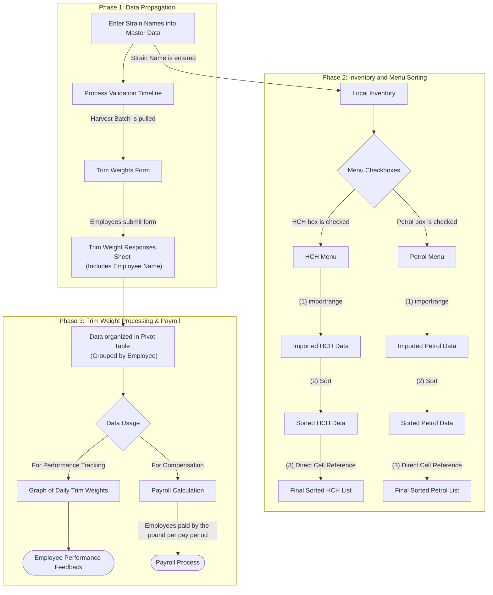

```mermaid
graph TD;
    subgraph "Phase 1: Data Propagation"
        A[Enter Strain Names into Master Data];
        B[Process Validation Timeline];
        C[Trim Weights Form];
        
        A --> B;
        B -- "Harvest Batch is pulled" --> C;
        C -- "Employees submit form" --> O;
    end

    subgraph "Phase 2: Inventory and Menu Sorting"
        E[Local Inventory];
        F{Menu Checkboxes};
        G[HCH Menu];
        H[Imported HCH Data];
        I[Sorted HCH Data];
        J[Final Sorted HCH List];
        K[Petrol Menu];
        L[Imported Petrol Data];
        M[Sorted Petrol Data];
        N[Final Sorted Petrol List];

        A -- "Strain Name is entered" --> E;
        E --> F;
        F -- "HCH box is checked" --> G;
        G -- "(1) importrange" --> H;
        H -- "(2) Sort" --> I;
        I -- "(3) Direct Cell Reference" --> J;

        F -- "Petrol box is checked" --> K;
        K -- "(1) importrange" --> L;
        L -- "(2) Sort" --> M;
        M -- "(3) Direct Cell Reference" --> N;
    end

    subgraph "Phase 3: Trim Weight Processing & Payroll"
        O["Trim Weight Responses Sheet <br/> (Includes Employee Name)"];
        P["Data organized in Pivot Table <br/> (Grouped by Employee)"];
        Q{Data Usage};
        R[Graph of Daily Trim Weights];
        S([Employee Performance Feedback]);
        T[Payroll Calculation];
        U([Payroll Process]);

        O --> P;
        P --> Q;
        Q -- "For Performance Tracking" --> R;
        R --> S;

        Q -- "For Compensation" --> T;
        T -- "Employees paid by the pound per pay period" --> U;
    end
```
